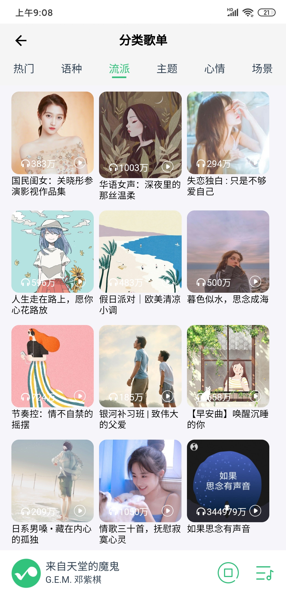

# 一个基于Vue全家桶的简易版QQ音乐webapp

[线上体验地址](http://112.124.25.149/)

二维码：


  

数据接口来自： <https://github.com/Rain120/qq-music-api>

项目git地址： ‘https://github.com/wangthing/vueMusicPlayer

## [项目]()启动

``` bash
$ git clone https://github.com/wangthing/vueMusicPlayer
$ cd vueMusicPlayer
# 下载项目依赖
npm install

# clone后台项目
$ git clone https://github.com/Rain120/qq-music-api
$ cd qq-music-api

#下载后台接口需要的依赖
$ npm install

#返回根目录并启动项目
$ cd ../
#同时运行两个项目
npm run start

# 后台项目默认3200
```

## 前言

​	其实很早之前就打算做一个有意思的项目练练手，不过之前的基础还是太差了，光 webpack配置和 vue组件化我都用的够呛， `css`布局也是胡乱用 。上个学期用 vue-cli 写的一个论坛社区也算很痛苦， 完全是为了应付课设，充分的体现了 能用不久行了嘛的思想，这次寒假认真的把基础补了一下，vue源码也尝试去阅读了一下，不过只能算是浅尝辄止，主要是去理解了 vue2如何实现响应式原理以及双向数据绑定，在把这些看完了之后再去使用vue还是别有一番新的体验的。就这样觉得自己算是稍微掌握了一些vue的知识 ，为了学以致用，就觉得开始做做个项目来试试这段时间的积累有没有大的提升。我自己也想尝试一下，现在的我到底能不能从0开始完成一个比较完整的项目。所以就开始这个项目，选择QQ音乐的原因一是我自己一直用的是QQ音乐，二是解决也有好几个大佬写过网易云音乐的了。

​	这次项目最大的体验还是明白了 `vue` 组件化带来的好处，当业务越来越大时，组件化的好处就逐渐体现出来了，代码的可服用复用，以及耦合度降低使得维护起来十分的方便，我也尝试着去封装了几个组件。`sass`对开发减少css代码编写， `vuex` 全局状态管理利用好使得组件之间的通信变得简单。

​	再自我介绍一下，我是一名来自华东交通大学17级软件工程的学生，平时除了学习前端之外还喜欢跑步，有喜欢长跑的也可以加个好友一起交流分享，微信号 `WJP990808`，寒假一个多月没怎么跑步了，最近开始恢复训练了，有喜欢跑步的可以一起，以后有马拉松还可以一起参加

​	


## 主要技术和工具介绍

**前端**

- `vue.js`                 一款渐进式js框架     渐进式这个词形容vue真的很贴切
- `vue-router`         vue的官方路由管理器
- `vuex`                     一些全局状态管理
- `vue-lazyload`       很好用的图片懒加载插件
- `axios`                     请求后台数据 
- `vue-bus`                  做一些组件之间的消息传递和事件触发
- `sass`                        说来惭愧只用了一些基本的语法，不过真的很好用，可以减少大量css代码
- `flex`布局                  这就不多说了，移动端布局必备
- `ES6`                           使用了部分新特性
- 组件化开发，提高代码的复用性，便于维护
- 以及一些好用的ES6新特性
- 后台数据
- `html5 audio` 实现音乐播放器 

**其他**

- 后台是上面提到的 `qq-music-api` ，有了真实的数据干起来才有劲
- `iconfont`阿里巴巴的官方图标库，真的很赞
- `vue-cli`脚手架， 快速初始化一个 vue项目
- `vscode` 编辑器，太占内存了，我就8g内存再加上谷歌浏览器十多个标签页，多难受就不多说了
- 项目部署在 阿里云服务器上，还是白嫖同学的。狗头

###  

### 主要功能界面和介绍

首页推荐（主要是热门歌单推荐）、 歌单详情页面、歌曲列表组件、分类歌单、 底部播放器组件、 播放列表组件、 歌词组件、排行榜页面、 排行榜详情、 歌手分类页面、 歌手详情页面、  搜索页面（热门搜索、历史搜索）、搜索结果展示、最近播放列表

## 主要难点和实现

- 播放歌曲点击定位按钮定位到当前列表正在播放的歌曲

  通过锚点定位再加上css的 `scrollbehavior： smooth `

  `或者`JS的 `scrollIntoView（{behavior： "smooth"}）` 就可以做到，

  歌词页面点击歌词跳转到这句歌词的进度的实现也是如此，不过定位是会定到浏览器顶端，

  可以通过添加一个子元素，隐藏子元素，通过定位子元素来达到把歌词定位到页面任意位置

- 点击歌词跳转主要要解决的是你在滑动歌词的时候阻止换歌词时页面滚动

- 歌词进度条变化，我是采取了比较暴力的 `watch` 监听当前播放时间从而改变宽度，当然要加上一个节流函数

- 由于显示歌词页面和播放列表是一个全局组件，通过 `vuex` 全局控制显示隐藏，当用户并没有点击左上角的隐藏按钮，而是直接用手机自带的返回或者浏览器的后退，会导致组件还显示，但是页面却回退了，甚至直接退出了。 我的解决办法是才用了 `vue-router` 的全局前置守卫， 当浏览器后退时候如果还是显示歌词页面的话会将歌词页面隐藏。

- 歌单和歌手详情的头部导航栏在下滑时会有标题和透明度的变化，也是通过节流监听滚动条的变化来改变，不过在一些浏览器比如微信和QQ内置的浏览器会失效，还没有找到原因

- 排行榜详情页面歌曲列表的接口返回的字段和其他页面的很不一样，甚至少了最关键的 `vkey` 字段，只能重复写了很多代码，歌曲列表组件在这个页面不能复用，解决办法就是先通过歌曲的专辑id查到专辑的歌曲列表，再返回这首的 `mid` 再去查询歌曲信息，绕了一个大弯很是头疼，导致后面的正在播放歌单列表增加了一大堆工作量。

- 有些付费的歌曲不能播放，后面看能不能从其他渠道找到播放源

- 搜索历史和播放历史用浏览器自带的 `localStorage` 来做存储，需要注意的是 `localStorage` 存储的是字符串，在进行读写的时候需要进行转化

- 搜索输入值改变时实时获取显示智能匹配，这个情景最算是双向数据绑定最经典的体现了

- 已经对一些请求存储在 `vuex` 做缓存优化， 对一些可能会常用的数据进行缓存可以减少请求，同时也是为了更好的用户体验。

- 在把项目放到  `nginx` 云服务器上时一开始还想着是不是 把项目开发环境直接放到服务器上 `npm install`然后 `npm run dev`,要不是看到网上说直接把 打包后的`dist`文件夹放上去就行了，差点就干这种傻事了。不过我后台是这样在服务器跑的，不知道有没有错。对于`webpack`为我们做了什么还是需要去学习的，而不是单纯的会用就行了。

  ​


## 部分页面截图

> 借鉴QQ音乐手机版的UI，但是关于和用户有关的都不能做，所以只好自由发挥了一些，有点四不像了

#### 首页推荐和轮播图


### 歌单详情


### 歌词页面


### 分类歌单




### 排行榜


### 歌手


### 搜索


## 之后还需要完善的

- 拖动进度条改变进度都没做， 播放器瞬间没了灵魂
- 随机播放也没做，没有想好怎么实现真的随机播放
- 歌曲播放页面不能跳到歌手详情页面
- 首页推荐的请求非常大，没有做骨架屏来防止数据异步加载导致屏幕一闪，
- 同时也可以考虑从服务端渲染渲染做首屏优化
- 没有做 `servicWorker` 做离线缓存，比如以前播放过的音乐
- 做音乐下载，不知道可不可以实现
- 最大的问题还是代码写的一坨坨，比较难看，不利于以后的维护，还是`又不是不能用`的程度
- 还有更多希望大家能给我一些宝贵的意见


